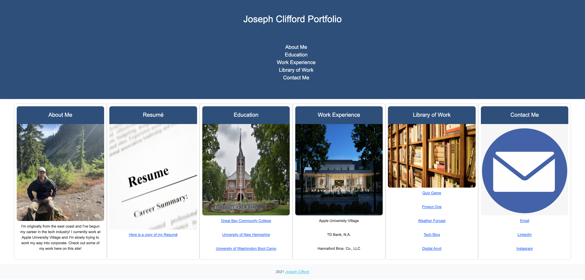

# Portfolio

### Table of Contents
1. [Title](#title)
2. [Contents](#tableOfContents)
3. [Description](#description)
4. [Links](#links)
5. [Images](#images)

## Description

Here is my updated Portfolio. I'll be working on a full blown one eventually but I'm here to focus on the rest of the Bootcamp! Having an absolute blast with the projects!

Check out the new links for the library of work! I even updated my resume link so you can get an even more recent copy. Everything else is basically the same but it gets the job done!

## Links

[Repository](https://github.com/joecliffordofficial/portfolioUpdated)
[Page](https://joecliffordofficial.github.io/portfolioUpdated/)

## Images

</img>